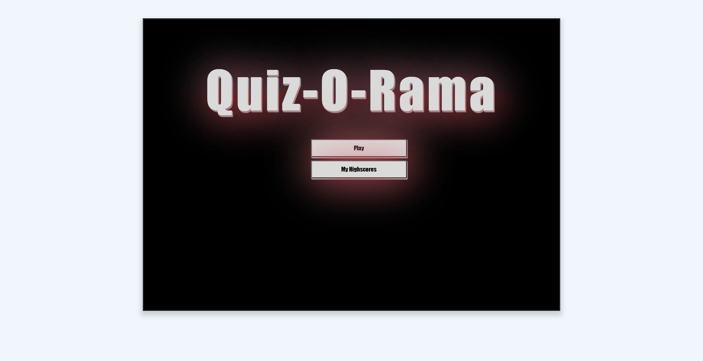
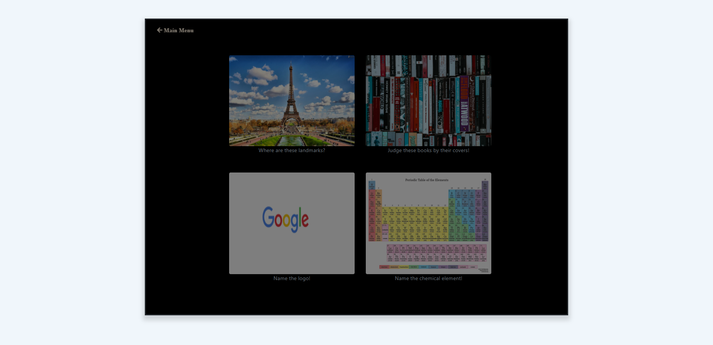
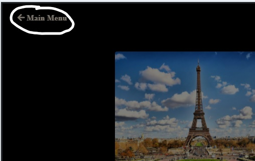
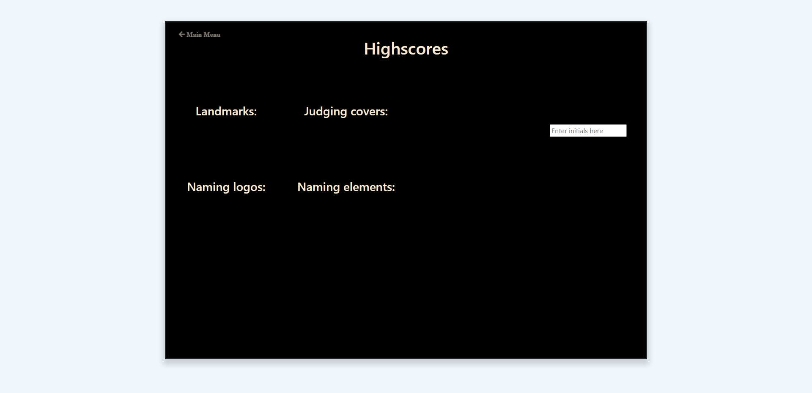

# Quiz-o-rama
## Test your knowledge!

Choose between 4 different quizes that will test different subjects. Once selected, you have 100 seconds to complete the quiz! Do your best to select the correct answer for each question. Be warned, if you get a question wrong you will be deducted 10 points AND 10 seconds from the timer. Correct answers will add 10 points to your score. At the end of the quiz the game will sum up your score and the remaining time to create your final score!

## Directions:

1. Start by clicking the 'Play' button on the main menu:

    

2. Next you will see 4 different games you can select:
    * Landmark quiz: This quiz will show a landmark and you need to guess WHERE the landmark is located.

    * Logo quiz: This quiz will display a logo and you need to guess what company the logo belongs to.

    * Book cover quiz: This quiz shows the cover of very famous books. See if you can choose the name of the book based on its cover!

    * Element quiz: This quiz will show various chemical element's abbreviated name, try to match it with the correct name.

    

    * Note: at any point you can return to the maain menu by clicking the button in the top left:
    
    

3.  Now you can enter your initials and your score will be logged on the highscores page!

    

